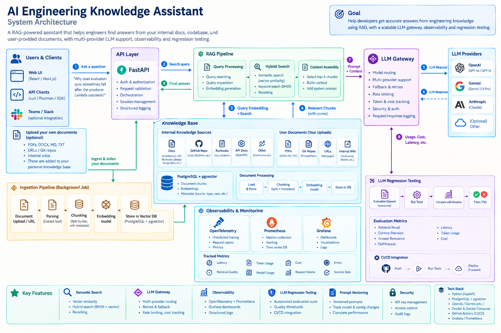

# KnoVaultAI

Production-style RAG knowledge assistant: upload documents, hybrid semantic and keyword search over **PostgreSQL + pgvector**, and grounded answers through an **OpenRouter** LLM gateway with pipeline observability.

## Project architecture



## Demo video

[](https://www.youtube.com/watch?v=C8h9xeHbw98)

## Tech stack

- **Backend:** Python, FastAPI, SQLAlchemy, Alembic
- **Frontend:** React 19, Vite, TypeScript, TanStack Query, Radix UI
- **Data:** PostgreSQL 16, pgvector, hybrid semantic + full-text (RRF)
- **ML / RAG:** sentence-transformers embeddings; PDF, DOCX, and other document parsing
- **LLM:** OpenRouter gateway with env-based routing plugs
- **Observability:** OpenTelemetry, Prometheus, Grafana (via Docker Compose)
- **Infra / CI:** Docker Compose; GitHub Actions ([.github/workflows/ci.yml](.github/workflows/ci.yml))

## Setup and run

**Prerequisites:** Docker and Docker Compose; set `OPENROUTER_API_KEY` in `.env` for live RAG answers.

```bash
cp .env.example .env
# Set OPENROUTER_API_KEY in .env

docker compose up --build -d
```

After the stack is up, run database migrations once (see [Migrations](#migrations)).

| Service | URL |
|--------|-----|
| API | http://localhost:8000 |
| API docs | http://localhost:8000/docs |
| Frontend (dev) | http://localhost:5173 |
| Grafana | http://localhost:3000 (admin/admin) |

**First use:** open the frontend → register or log in → create a knowledge base → upload documents on the **Documents** tab → ask questions on the **Ask** tab.

## Environment variables

See [.env.example](.env.example). Important keys:

- `DATABASE_URL` — Postgres (default matches `docker-compose.yml`; use Supabase URI when deployed)
- `LOCAL_STORAGE_DIR` — uploaded file blobs when `STORAGE_BACKEND=local` (Docker volume `document_storage`)
- `STORAGE_BACKEND` — `local` (default) or `supabase` for Supabase Storage
- `SUPABASE_URL`, `SUPABASE_SERVICE_ROLE_KEY`, `SUPABASE_STORAGE_BUCKET` — required when using Supabase Storage (server-only; never expose in the frontend)
- `EMBEDDING_MODEL` / `EMBEDDING_DIM` — sentence-transformers (default `all-MiniLM-L6-v2`, 384-d)
- `OPENROUTER_API_KEY`, optional `OPENROUTER_MODEL` override
- `LLM_ROUTING_DEFAULT_PLUG`, `LLM_ROUTING_QUALITY_PLUG`, `LLM_ROUTING_FAST_PLUG` — auto-routing
- `LLM_ROUTING_STRONG_SIMILARITY_THRESHOLD` — minimum semantic similarity for strong/fast routing (default `0.35`)

## Migrations

```bash
make migrate-db
# or
docker compose exec fastapi_app alembic upgrade head
```

## Tests

```bash
pip install -r requirements.txt --extra-index-url https://download.pytorch.org/whl/cpu
pytest tests/unit -q
make test   # all tests when integration DB is available
```

## Evaluations

Requires indexed content and `OPENROUTER_API_KEY` for non-mock answers:

```bash
make run-evals
make save-baseline
```
